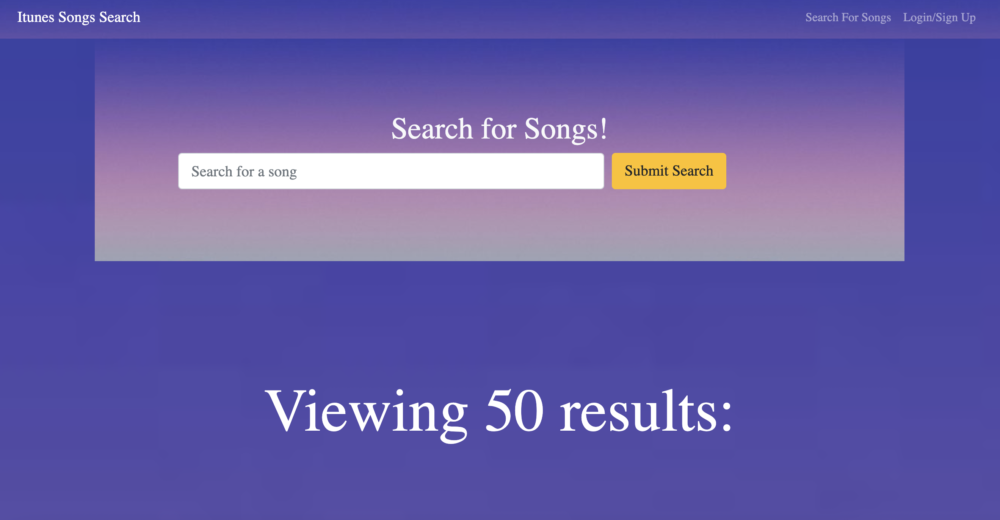
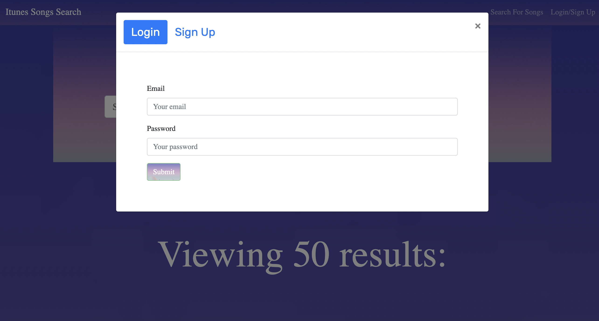

# SHUFFLE Music Finder

## Description
An Apple Itunes Music search engine that allows you to create a user, discover music and create lists of saved songs. This application was built using the MERN Stack, a React front-end, MongoDB database, a Node.js/Express.js server and GraphQL API, queries and mutations to Retrieving, adding and updating data from the Itunes API.
 

  ## Table of Contents

* [Installation](#installation)
* [Deployment](#deployment)
* [License](#license)
* [Mockup](#mockup)
* [Questions](#questions)

## Installation 
After cloning the repo, run `npm i` to install the dependencies from the root, the server and the client folder.

To start the application, run from the root directory:
`npm run develop`. 

## Deployment
You can see the deployed Application [here](deployment link here).

## License

## Mockup

## Questions
If you have any questions about this project, contact us through our GitHub accounts:
 * [Liz Arias](https://github.com/lizariasc).
 * [Inara Nyingifa](https://github.com/inara-nyingifa).
 * [Alex Aranda](https://github.com/arand013).